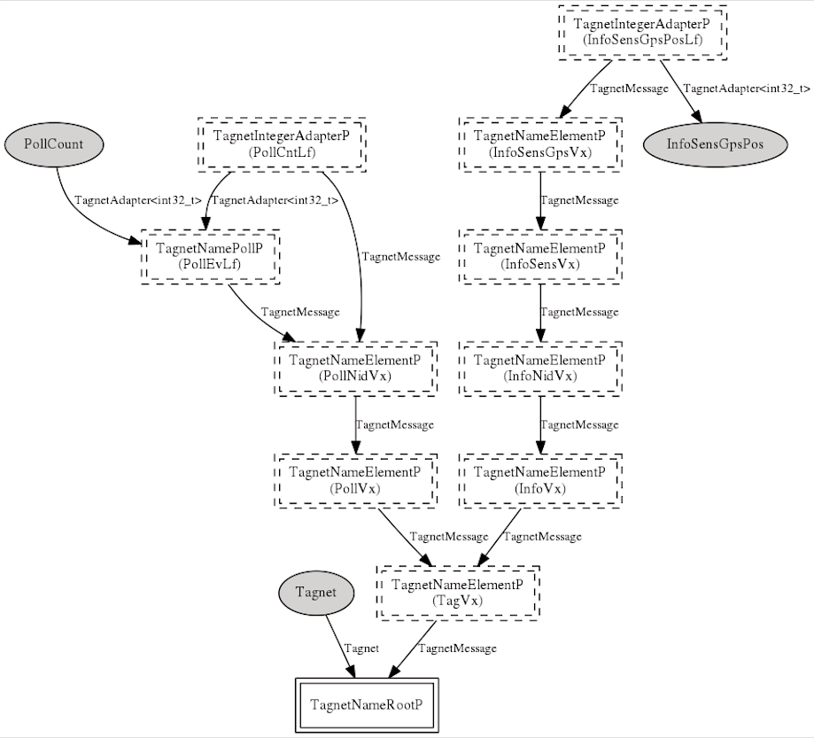
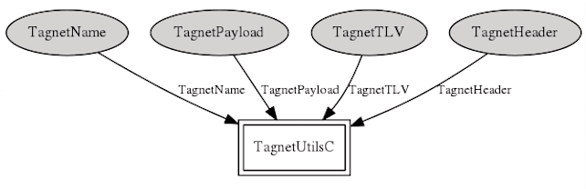

# Tagnet Protocol Stack

A network protocol for micro-powered, constraint-based mobile devices to collect location and sensor data using named data objects over ad hoc radio networks.

## Copyright

@author Daniel J. Maltbie <dmaltbie@daloma.org>

@Copyright (c) 2017 Daniel J. Maltbie
All rights reserved.


Redistribution and use in source and binary forms, with or without
modification, are permitted provided that the following conditions
are met:

- Redistributions of source code must retain the above copyright
  notice, this list of conditions and the following disclaimer.

- Redistributions in binary form must reproduce the above copyright
  notice, this list of conditions and the following disclaimer in the
  documentation and/or other materials provided with the
  distribution.

- Neither the name of the copyright holders nor the names of
  its contributors may be used to endorse or promote products derived
  from this software without specific prior written permission.

THIS SOFTWARE IS PROVIDED BY THE COPYRIGHT HOLDERS AND CONTRIBUTORS
"AS IS" AND ANY EXPRESS OR IMPLIED WARRANTIES, INCLUDING, BUT NOT
LIMITED TO, THE IMPLIED WARRANTIES OF MERCHANTABILITY AND FITNESS
FOR A PARTICULAR PURPOSE ARE DISCLAIMED.  IN NO EVENT SHALL
THE COPYRIGHT HOLDER OR CONTRIBUTORS BE LIABLE FOR ANY DIRECT,
INDIRECT, INCIDENTAL, SPECIAL, EXEMPLARY, OR CONSEQUENTIAL DAMAGES
(INCLUDING, BUT NOT LIMITED TO, PROCUREMENT OF SUBSTITUTE GOODS OR
SERVICES; LOSS OF USE, DATA, OR PROFITS; OR BUSINESS INTERRUPTION)
HOWEVER CAUSED AND ON ANY THEORY OF LIABILITY, WHETHER IN CONTRACT,
STRICT LIABILITY, OR TORT (INCLUDING NEGLIGENCE OR OTHERWISE)
ARISING IN ANY WAY OUT OF THE USE OF THIS SOFTWARE, EVEN IF ADVISED
OF THE POSSIBILITY OF SUCH DAMAGE.

## Tagnet Implementation Files

The following lists the various files that make up the Tagnet stack implementation. From the system standpoint, all user interfaces are exposed through the TagnetC configuration component. The other configurations simplify wiring for the network stack building block modules and utility functions.

  * Configurations (6):
     * TagnetC
     * TagnetNameRootP
     * TagnetNameElementP
     * TagnetNamePollP
     * TagnetNameIntegerP
     * TagnetUtilsC

  * Interfaces (7):
     * Tagnet
     * TagnetMessage
     * TagnetName
     * TagnetHeader
     * TagnetPayload
     * TagnetTLV
     * TagnetAdapter

  * Modules (8):
     * TagnetNameP
     * TagnetHeaderP
     * TagnetPayloadP
     * TagnetTlvP
     * TagnetNameElementImplP
     * TagnetNameRootImplP
     * TagnetNamePollImplP
     * TagnetNameIntegerImplP

  * Includes (2):
     * Tagnet.h
     * TagnetTLV.h

## Implementation Model

The implementation model for the Tagnet Stack utilizes nesC generic components and hierarchical wiring of parameterized interfaces to construct the search tree for matching network names and wiring to the associated action. This makes it easy to modify and extend the object names through simple changes to module instantiation and wiring, which is all found in TagnetC.nc. The Tagnet Stack diagram below illustrates the Tagnet stack implementation model for a simple configuration that exposes just three named data objects.

1. /tag/poll/NID/ev
2. /tag/poll/NID/cnt
3. /tag/info/NID/sens/gps/pos

The first two objects are somewhat special in that the Tagnet POLL message has some special handling requirements. The third name, on the other hand, shows a typical example of how the stack translates from a network name to a specific variable exposed by the appropriate module (in this case the GPS module). The '/tag/poll/NID/ev' object is a function-based object that handles the special poll request requirements and is implemented inside of the stack. The '/tag/poll/NID/cnt' object provides an integer variable that reflects the count of the number of times this device has received a poll request message. The '/tag/info/NID/sens/gps/pos' object refers to a gps position type variable and contains the last read GPS location fix.

The stack is implemented by constructing a tree with each node representing one element of the object name. This is done pre-compile time by instantiating modules and wiring them together to create the tree containing all exposed variables in the system (in this case, there are just three).

The root of the Tagnet stack is exposed through the *Tagnet* interface. The root module will insure that the stack is properly initialized for processing a new request message and will verify that a response is required upon return. A TagnetNameElementP is a generic module instantiated for each unique element at each level of the name. This module is responsible for matching it's element to the name in the request, and continuing down the tree if it matches. Once all elements in the request name have been matched, successfully, the terminal element module will perform the requested action.

For leaf nodes this typically involves an adapter module that know how to convert a C Type into a Tagnet TLV. If the match completes at an intermediate element, the action will behave more like a directory entry. For instance, a GET on '/tag/poll/NID' would get the name and value for each of its sub-elements. In this case, four TLVs are returned [(name:ev, value:35)(name:ev, value:POLL_RSP)]. Each intermediate node will sequentially call its subordinate elements to see if any of them match. When a match is found, the result is returned. If matching fails at any point or all choices are exhausted, nothing is returned.



In addition to interface for accessing the name tree, there are a set of utility interfaces available for operating on Tagnet messages. Typically user applications don't need to use these. They provide the following capabilties to access the various fields of a Tagnet message (header, name, and payload) as well as for manipulating Tagnet TLVs.



## Protocol Features
  - Named Data Objects
    - A name is an arbitrary string consisting of distinct substrings to represent hierarchical structures
      - substrings are typed
    - Nodes in the network use names to specify access of information structured in a key/value store
    - Names allow arbitrary depth and breadth of information hierarchy
    - Names can refer to static information (e.g, serial number) or dynamic content (current GPS location)
    - separation of name (index) and data
      - A named data object allows the network to separate the identification of the content from the contents itself
      - index can be copied separately from data
        - allows caching of index at user for fast lookup
      - the index provides the hierarchical address for a unit of data
      - support untrusted storage service by encrypting data prior to storing it
        - index is separately readable
      - Objects can be cached in the network, allowing intermediate storage to be used with the potential for multiple identical copies providing network efficiency and data resiliency
  - Get/Put Operations
    - information hierarchy is accessed with put and get commands
    - get on intermediate node in hierarchy returns a list of its sub nodes
  - Object Store
    - each blob has a unique name
    - the name consists of a hierarchical list of sub names
    - subnames can be ascii strings or they can be predefined types
    - pre-defined types support protocol features
      - block and byte indexing
      - error codes
  - Schema
    - The schema provides three distinct uses:
      - Data Structure Definition
        - Documentation and validation
      - Persistent Storage Attributes
        -  Information pertinent to persisting data
      - Interaction Control
        - Hints on how to render UI where data can be manipulated
    - the flexibility in uses reduces the level of complexity in maintenance while enabling several important features:
      - Naming individual resources and attributes of Control Plane resources using TagNet content names
      - A tree naming system for creating collection and resource hierarchies
      - Each resource can maintain a base set of attributes as well as can be decorated with additional runtime or user-specific attributes
      - Bundled documentation that is run-time accessible
      - Add, modify, remove resources or update attributes at any node of the network (with proper security keys)
        - As little as one attribute, as many as all resources, and everything in between
    - provide constraints on the data (e.g. data types, required properties, minimum lengths), which can be used to provide a default editing interface.
    - can reference/link to other schemas, and specify complex behaviours - for example, conditional schemas that only apply if a particular property is present, or lists of sub-schemas of which only one may apply. However, each schema has a unique URI, so they are perfect for selecting custom renderers.
  - segmentation
    - blob is the basic unit of transfer and retrieval
    - contiguous sequence of blobs in a resource
    - typically a single blob can fit into a message
      - if not, then byte indexing can be used to retrieve portions
      - not a good idea to have over-size blobs
    - optional append-only blob writes to resources
      - ensures data is immutable
    - blobs can be signed and encrypted
    - blobs can be stored at different (even multiple) locations

##Tagnet Protocol BNF Description
```
frame          =  frame_length
                  + response_flag[7:1] + version[4:3] payload_type[0:1]
                  + message_type[5:3] + options[0:5]
                  + name_length
                  + packet
frame_length   =  6..255
response_flag  =  Enum( 'REQUEST'=0, 'RESPONSE'=1 )
version        =  1
payload_type   =  Enum( 'RAW'=0 | 'TLV_LIST'=1 )
message_type   =  Enum( 'POLL'=0 | 'BEACON'=1 | 'HEAD'=2
                       | 'PUT'=3 | 'GET'=4 | 'DELETE'=5 | 'OPTION'=6  )
options        =  [error_code if (frame.response_flag) else hop_count]
name_length    =  2..251

packet         =  poll | beacon | put | get | delete | head | options
name           =  tlv | tlv + name
*(rsp)         =  (frame.response_flag set to TRUE)

poll           =  name('tag' + 'poll' + tlv_node_id(my_mac()) + 'ev')
                  + payload(tlv_time(now())
                            + tlv_integer(SLOT_TIME)   // milliseconds
                            + tlv_integer(SLOT_COUNT))
poll(rsp)      =  poll.name
                  + payload(tlv_node_id(my_mac())
                            + tlv_node_name(hostname())
                            + tlv_time(now()))
head           =  name
head(rsp)      =  head.name + payload
beacon         =  name('tag' + 'beacon' + tlv_node_id(my_mac()) + 'id')
                  + payload(tlv_list(list of tagnet_tlv_t tuples))
beacon(rsp)    =  beacon.name
                  + payload(tlv_list(list of tagnet_tlv_t tuples))
put            =  name + payload
put(rsp)       =  put.name
get            =  name [+ payload]
get(rsp)       =  get.name + payload
delete         =  name
delete(rsp)    =  delete.name
option         =  name + payload
option(rsp)    =  option.name + payload

payload        =  raw_bytes | tlv_list
raw_bytes      =  BYTE[frame_length - name_length]

hop_count      =  1..31
error_code     =  Enum( 'OK'=0 | 'NO_ROUTE'=1 | 'TOO_MANY_HOPS'=2
                  | 'MTU_EXCEEDED'=3 | 'UNSUPPORTED'=4
                  | 'BAD_MESSAGE'=5 | 'FAILED'=6 | 'NO_MATCH'=7 )

tlv_list       =  tlv | tlv + tlv_list
tlv            =  tlv_type + tlv_length + tlv_value
tlv_type       =  Enum( 'NONE'=0, 'STRING'=1 | 'INTEGER'=2 | 'GPS_POS'=3
                  | 'UTC_TIME'=4 | 'NODE_ID'=5 | 'NODE_NAME'=6
                  | 'SEQ_NO'=7, 'VER_NO'=8 | 'FILE'=9 | '_COUNT'=10 )
tlv_length     =  0..254
tlv_value      =  is one of the following based on tlv_type
  tlv_string   =  BYTE[tlv_length]
  tlv_integer  =  BYTE[tlv_length]   // scales 1..n(value)
  tlv_datetime =  temporenc          // encoded [YYYY-MM-DD HH:MM:SS.UUUUUU]
  tlv_node_id  =  BYTE[6]
  tlv_node_name=  tlv_string
  tlv_tlv      =  tlv_list
  tlv_offset   =  tlv_integer
  tlv_count    =  tlv_integer
```
